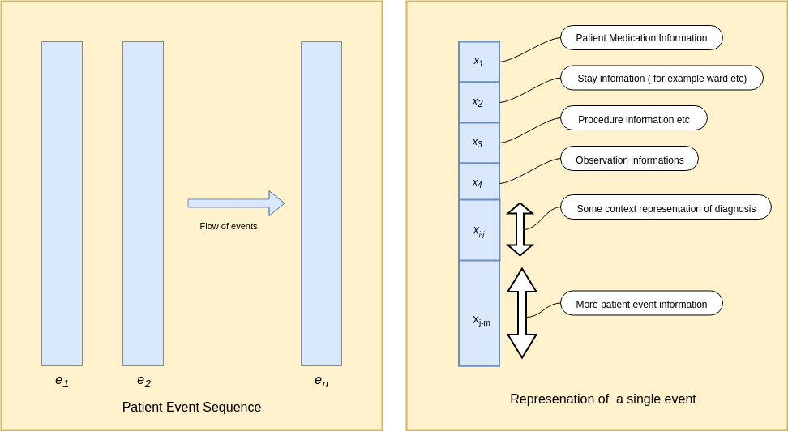
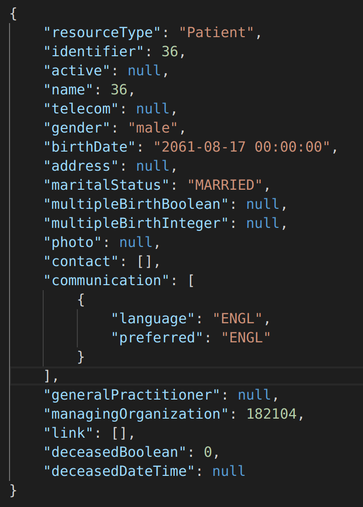
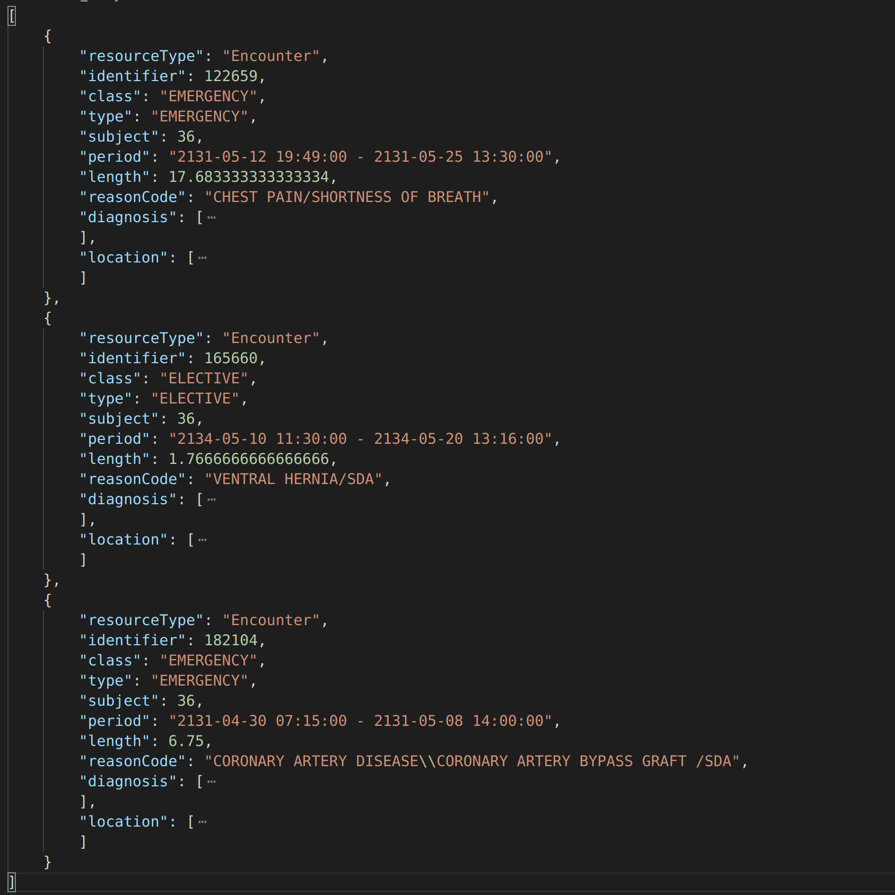

# Patient timeline representation to model EHR data.

# Authors
Parth Tandel, Priya Singh, Monica Mishra

# Summary
The large volume of healthcare records is difficult to use directly given their complicated relational structure with a wide variety of variables, for instance, the timing of a visit to a
hospital, services performed during the stay,
initial diagnosis by the primary caregiver, lab
reports, etc. As the information is scattered
across various tables, any machine learning
algorithm is forced to utilize only a subset of
features from the dataset. The MIMIC-III1
dataset contains tables namely ADMISSIONS
(information about patient visits), INPUTEVENTS
(readings of health monitor machines),
CHARTEVENTS (record of medicines taken by
patients), etc. This dataset contains records of
adult patients (aged 16 years or above) admitted
to critical care units between 2001 and 2012.
The dataset is rich in information yet due to
the immense size of tables (~50 GB), it cannot be
used directly to predict the length of stay or the
readmission chance of a patient. The proposed
solution to this problem is the creation of a
timeline of events for a patient. The sequence of
events captures an exhaustive list of relevant
occurrences. Our efforts are heavily inclined
towards creating a single source dataset that
captures entire information of a patient which
advertently makes training an ML model. Based
on our study of related previous work2, an
important first step to achieve the desired
timeline representation is to convert our MIMICIII into a standard format - Fast Healthcare
Interoperability (FHIR)3.

This converted dataset
in FHIR format would then be transformed into a
sequence of events to represent the patient
timeline. This created timeline would then be
utilized as an input to deep neural network
models such as CNN, LSTM. The timeline
representation would be effective to build
supervised prediction or classification models.
Once the data transformed into the desired
format we intend to explore the answers for the
following questions:
* Predict the readmission chance of a patient.
* Predict the length of stay of a patient at the
hospital.
* Predict the survival chance of a patient given
an ailment.

# Proposed plan of research
The main task of the project is the creation of a data pipeline to represent a patient's history, after extensive research on restructuring the data, 
The next phase of the project is to convert the FHIR data obtained from the previous phase to timeline representation and build models on top of it. The first part of this process would be to identify all the feature values required in the sequence. Once these features are identified, they will be extracted. Processing for both numerical values eg. medicine information, chart values, etc and encoding textual information like reports and diagnosis would be done. Using all this information sequence of visits to the hospital would be compiled together. Using this data an LSTM, RNN based model would be trained which would leverage the sequential nature of data and then make a prediction.

 Figure 1 : Proposed Timeine represenation of patients Data 

 Figure 2: Patient Timeline 

We aim to create sequence vectors to capture the timeline of events using deep neural network techniques such as Long Short Term Memory (LSTM) and Convolutional Neural Network (CNN), and 
try to answer critical questions for instance:
* What are the chances of a patient to be readmitted? 
* How long would a patient stay for a known ailment? 
* Is it possible to predict the chance of survival? 

### Data description
The reason to convert MIMIC to FHIR is that FHIR is a standard next-generation framework created by HL7. FHIR solutions are built from a set of modular components called "Resources".
These resources can easily be assembled into working systems that solve real-world clinical and administrative problems. FHIR is suitable for use in a wide variety of contexts – mobile phone
apps, cloud communications, EHR-based data sharing, server communication in large institutional healthcare providers, and much more. FHIR data is generally accepted as it is fast and
easy to implement. Strong foundation in Web standards: XML, JSON, HTTP, OAuth, etc. makes it a human-readable serialization format that could be easily used by the developers. A challenge faced by healthcare standards is how to manage the diverse variability caused by healthcare processes. As time progresses, many new fields and optional features are getting added that results in additional complexity in managing the base implementation. FHIR tackles this problem by defining a simple framework for extending the existing resources and describing their use with profiles.

Following are some resources that we selected and converted form MIMIC III dataset:

* Patient resource communicates general information of the patient.
* Encounter resource is about a person’s visit to the hospital.
* Procedure resource has information on the procedures performed on a patient during a single visit to the hospital.
* Report resource discusses the diagnostic reports for a particular patient. 
* Medication Dispense resource contains data about the medications given to the patient.
* Observation resource contains lab reports
for a patient. 

# Preliminary results
To get the patient resource in FHIR format as shown in figure 3, the Admission Table and patient table were used to fill out the
corresponding information. Similarly, for Encounter resource as seen in figure 4 the information about the patient's visits were found in Admission table, the information about the diagnosis was found Diagnoses_icd and D_icd_diagnoses table, the information about the locations can be found in transfers table and then were compiled together to form Encounters FHIR resource. Similar processes were performed for all other resources.

 Figure 3: Patient FHIR Resource 

 Figure 4: Encounter FHIR Resource 

# References
[1] Alpha.physionet.org. (2019). MIMIC-III
Clinical Database v1.4. [online] Available
at: https://alpha.physionet.org/content/mimiciii
/1.4/ [Accessed 28 Sep. 2019].

[2] Rajkomar, A., Oren, E., Chen, K., Dai, A., Hajaj,
N., Hardt, M., Liu, P., Liu, X., Marcus, J., Sun, M.,
Sundberg, P., Yee, H., Zhang, K., Zhang, Y., Flores,
G., Duggan, G., Irvine, J., Le, Q., Litsch, K., Mossin,
A., Tansuwan, J., Wang, D., Wexler, J., Wilson, J.,
Ludwig, D., Volchenboum, S., Chou, K., Pearson,
M., Madabushi, S., Shah, N., Butte, A., Howell,
M., Cui, C., Corrado, G. and Dean, J. (2018).
Scalable and accurate deep learning with
electronic health records. npj Digital Medicine,
1(1).

[3] Anon, (2019). [online] Available at:
https://www.hl7.org/fhir/formats.html
[Accessed 5 Nov. 2019].